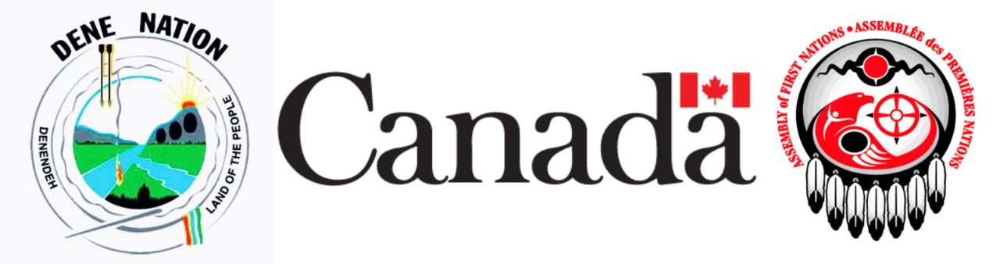

## Funding

The Western Boreal Initiative is a collaborative co-production between multiple government agencies, university researchers, and indigenous groups.

-   Natural Resources Canada, Canadian Forest Service (NRCAN-CFS)
-   Environment and Climate Change Canada, Canadian Wildife Service (ECCC-CWS)
-   Environment and Climate Change Canada, Science and Technology Branch (ECCC-STB)

## Project Leads

+--------------------------------+--------------------------+------------------+
| -   Samuel Hache (ECCC-CWS)    | Advisory Team Lead       |                  |
| -   Eliot McIntire (NRCAN-CFS) | Implementation Team Lead |                  |
| -   Mathieu Leblond (ECCC-STB) |                          |                  |
| -   Junior Tremblay (ECCC-STB) |                          |                  |
| -   Tati Micheletti (UBC)      |                          |                  |
+--------------------------------+--------------------------+------------------+

## Implementation Team

+--------------------------------------------------+--------------------------------+------------+
| -   Ceres Barros (UBC)                           | -   Eliot McIntire (NRCAN-CFS) |            |
| -   Celine Boisvenue (NRCAN-CFS)                 | -   Tati Micheletti (UBC)      |            |
| -   Alex Chubaty (FOR-CAST Research & Analytics) | -   Greg Paradis (UBC)         |            |
| -   Steve Cumming (ULaval)                       | -   Ana Raymudo (ULaval)       |            |
| -   Ian Eddy (NRCAN-CFS)                         | -   Jackie Saturno (Dalhousie) |            |
| -   Josie Hughes (ECCC-STB)                      | -   Alana Westwood (Dalhousie) |            |
| -   Isolde Lane-Shaw (ULaval)                    | -   Dene Nation                |            |
| -   Frances Stewart (LaurierU)                   |                                |            |
+--------------------------------------------------+--------------------------------+------------+

## Advisory Committee

+-------------------+---------------------------+----------------------------+
| -   S. Avery-Gomm | -   Z. Gadallah           | -   J. Olesenski           |
| -   A. Calvert    | -   M. Gahbauer           | -   J. Polfus              |
| -   S. Carriere   | -   C. Haas               | -   E. Reed                |
| -   K. Clark      | -   S. Hache (ECCC-CWS)   | -   J. Schroeder           |
| -   L. Coristine  | -   J. Hodson (GNWT)      | -   L. Smith               |
| -   A. Cox        | -   T. Imlay              | -   R. Steenweg            |
| -   D. Cyr        | -   B. Laurich            | -   B. Stewart             |
| -   A. Dookie     | -   M. Leblond (ECCC-STB) | -   D. Stralberg           |
| -   I. Duclos     | -   L. Mahon              | -   C. Toth                |
| -   W. Easton     | -   O. Melnyk             | -   J. Tremblay (ECCC-STB) |
| -   B. Frei       | -   E. Nichol             | -   S. Van Wilgenburg      |
|                   | -   A. Norris             |                            |
+-------------------+---------------------------+----------------------------+
